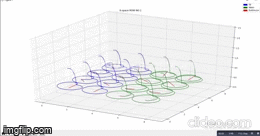

# Programming Assignment 3 
| Submitted to: | Prof/ Inas A. Yassine |
| ----------- | ----------- |
| **By** | - Adel Moustafa |
|     | - Mahmoud Abdelrhman |
|     | - Mohamed Kamal |
|     | - Mohamed Yasser |

# Bulk magnetization vector
​		There are three used functions to rotate the bulk magnetization vector and plot its trajectory:

**1.Excitation:** It's used to rotate the bulk magnetization around X_axis and its trajectory during excitation process.

**2.Relaxation:** It's used to rotate the bulk magnetization and its trajectory during relaxation process.

**3.Update_line:** It's used to update the plotted data.

In addition to **get_parametesrs()**, which used to get parameters by console (Ask to add nonuniformity effect or not)

  - We work on 4X4 voxel in our simulation, 8 spins represent oil and 8 for water.
  - All parameters are assumptions to make the simulation easier. 
  - But we took into consideration that T1, T2 for oil is shorter than water and also T1 is longer in general.
  - Also we add frequency encoding and phase encoding, so each spin will have different frequency that is shown in simulation.
  - We have 4 rows to fill in K-Space 

**This gif Simulate Without nonuniformity effect**

**NOTE** The gif is 20 seconds, we have a **video** in the image file, please take a look

# Uniform K-Space 

The uniform k-space is calculated using the function **uniform_kspace(img)** which takes the created phantom by the function **shepp_logan()** and calculates the FFT for the phantom.   

**The Phantom.**

**The Phantom's uniform k-space.**

**Inverse of uniform k-space.**

# Non-uniform K-Space

The non-uniform k-space is calculated using the function **non_uniform_kspace(phantom)** which takes the created phantom using the function **shepp_logan()** and calculates the non-uniform FFT for it, which simulates the effect of the non-uniform external magnetic field.

**The Phantom's non-uniform k-space.**

